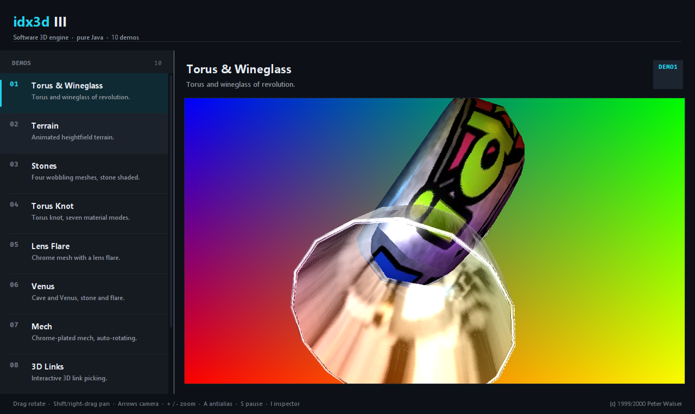

# idx3d III

**idx3d III** is one of the first pure-Java software 3D engines, originally written by
Peter Walser in 1999/2000. It renders everything in software (no OpenGL, no external
dependencies) and shipped with a set of demos that ran as Java Applets.

This repository is a modernization of the original source:

- reorganized into a **Maven multi-module** project and migrated to **Java 17**;
- the Applet front-end replaced with **Swing** components;
- the demos collected into a single executable desktop application with a modern dark UI.



## Running

Requirements: **JDK 17+** and **Maven 3.9+**.

```bash
mvn                # default goals are 'clean package'
java -jar idx3d-app/target/idx3d.jar
```

The launcher opens with **demo1** selected. Pick any demo on the left; it runs on the
right.

Animations play at 1/10 speed by default (smooth slow motion). Override the factor with
`-Didx3d.animationScale=1` for the original speed, or e.g. `0.25` for a gentler slowdown.

### Controls (shared by the demos)

| Input | Action |
| --- | --- |
| Drag | Rotate the scene |
| Shift-drag / right-drag | Pan the scene |
| Arrow keys | Move the camera |
| Page Up / Page Down | Zoom the camera |
| `+` / `-` | Scale the scene |
| `A` | Toggle antialiasing |
| `S` | Pause the animation |
| `I` | Open the scene inspector |
| `Space` | Print the current FPS to the console |

Individual demos add their own keys (materials, effects, projections, …); the status bar
summarizes the shared ones.

## Project layout

```
idx3d/
├── idx3d-core/    the engine: rasterizer, scene graph, math, texture/3DS IO, effects
├── idx3d-demos/   the 10 selected demos (Swing components) + their assets
└── idx3d-app/     the dark-themed launcher and the shaded uber jar
```

- **`idx3d-core`** — `idx3d_Scene`, `idx3d_RenderPipeline`, `idx3d_Rasterizer`,
  `idx3d_Screen`, `idx3d_Object`, `idx3d_Material`, `idx3d_Texture`,
  `idx3d_3ds_Importer`/`Exporter`, the `idx3d.implicit` isosurface code, and the
  `idx3d.debug` inspectors. `idx3d_DemoPanel` is the Swing base class the demos extend,
  and `idx3d_Resources` loads assets from the classpath.
- **`idx3d-demos`** — `Demo01`, `Demo02`, `Demo03` (Stones), `Demo04`, `Demo06`, `Demo07`,
  `Demo08`, `Demo10`, `Demo11` and `Demo12`. `DemoCatalog` is the registry used by the
  launcher.
- **`idx3d-app`** — `Main`, `MainFrame`, the sidebar/viewport, the dark `Theme`, and the
  Maven Shade configuration that produces the self-contained jar.

## How it was modernized

- `enum` used as an identifier (illegal since Java 5) renamed to `enumeration`.
- Removed `com.sun.image.codec.jpeg` replaced with `javax.imageio`.
- Legacy `Toolkit`/`PixelGrabber` texture loading replaced with `BufferedImage`/`ImageIO`.
- The custom AWT `ImageProducer` replaced by a `BufferedImage` backed directly by the
  engine's pixel buffer.
- `java.applet.Applet` and the AWT-1.0 event model replaced with `JPanel`, a render
  thread and `MouseListener`/`KeyListener`.
- Assets moved onto the classpath (`/assets/...`) so they are bundled in the uber jar.

## License / credits

idx3d III is © 1999/2000 by **Peter Walser** and was released for non-commercial use.
This modernized port keeps the original engine behavior and credits; see the header
comment in each source file.
